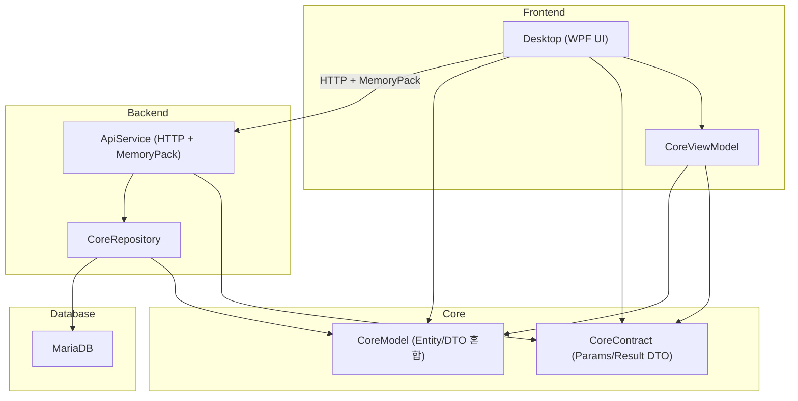

```mermaid
graph TD

    %% Frontend Group
    subgraph Frontend
        Desktop["Desktop (WPF UI)"]
        CoreViewModel["CoreViewModel"]
    end

    %% Backend Group
    subgraph Backend
        ApiService["ApiService (HTTP + MemoryPack)"]
        CoreRepository["CoreRepository"]
    end

    %% Core (공통 계약/모델) Group
    subgraph Core
        CoreContract["CoreContract (Params/Result DTO)"]
        CoreModel["CoreModel (Entity/DTO 혼합)"]
    end

    %% Database Group
    subgraph Database
        MariaDB["MariaDB"]
    end

    %% 참조 구조
    Desktop --> CoreViewModel
    Desktop --> CoreContract
    Desktop --> CoreModel

    CoreViewModel --> CoreContract
    CoreViewModel --> CoreModel

    ApiService --> CoreContract
    ApiService --> CoreRepository
    CoreRepository --> CoreModel
    CoreRepository --> MariaDB

    %% MemoryPack over HTTP 통신 경로
    Desktop -- HTTP + MemoryPack --> ApiService
```
