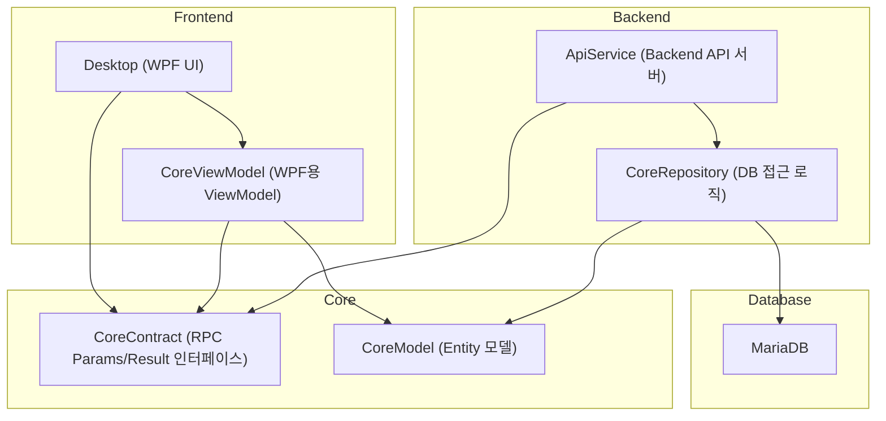

```mermaid
graph TD

    %% Frontend Group
    subgraph Frontend
        Desktop["Desktop (WPF UI)"]
        CoreViewModel["CoreViewModel (WPF용 ViewModel)"]
    end

    %% Backend Group
    subgraph Backend
        ApiService["ApiService (Backend API 서버)"]
        CoreRepository["CoreRepository (DB 접근 로직)"]
    end

    %% Core (Shared) Group
    subgraph Core
        CoreContract["CoreContract (RPC Params/Result 인터페이스)"]
        CoreModel["CoreModel (Entity 모델)"]
    end

    %% Database Group
    subgraph Database
        MariaDB["MariaDB"]
    end

    %% 참조 관계
    Desktop --> CoreViewModel
    Desktop --> CoreContract

    CoreViewModel --> CoreContract
    CoreViewModel --> CoreModel

    ApiService --> CoreContract
    ApiService --> CoreRepository
    CoreRepository --> CoreModel
    CoreRepository --> MariaDB
```
