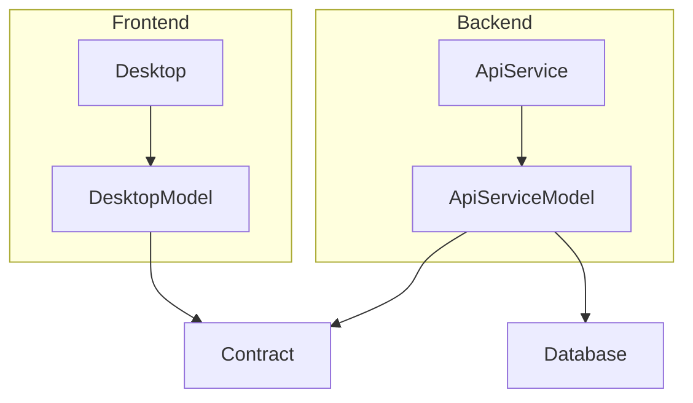

# 프로젝트 아키텍처 정리

## 전체 구조 및 역할

| 역할               | 프로젝트 예시              | 주요 내용                                              |
|--------------------|---------------------------|-------------------------------------------------------|
| **Frontend**       | Desktop (WPF View, ViewModel) + DesktopModel (UI Model) | UI 화면과 사용자 상호작용, UI 비즈니스 로직 포함된 Model 관리 |
| **Backend**        | ApiService (비즈니스 로직 처리) + ApiServiceModel (Domain Model) | 도메인 핵심 비즈니스 로직, 상태 관리 및 검증 담당           |
| **Contract**       | Contract (DTO / 데이터 명세) | Frontend와 Backend 간 통신 데이터 구조 및 규약 정의           |

## 통신 관련

- **MemoryPack**:  
  Contract에 정의된 데이터 구조에 대해 직렬화/역직렬화를 수행  
- **Contract**는 순수 데이터 구조만 포함하고,  
- **Frontend**와 **Backend**는 각각 Contract를 참조하여 자신만의 Model(비즈니스 로직 포함)을 구현

## 장점

- 명확한 역할 분리로 유지보수성, 확장성 향상  
- UI, API 서비스, 데이터 명세 각각 독립적으로 변경 가능  
- MemoryPack 등 직렬화 기술을 Contract에만 집중 적용해 코드 중복 최소화  
- 서로 다른 서비스 간 Contract 공유로 통신 안정성 확보

---

## 아키텍처 다이어그램 (Mermaid)

