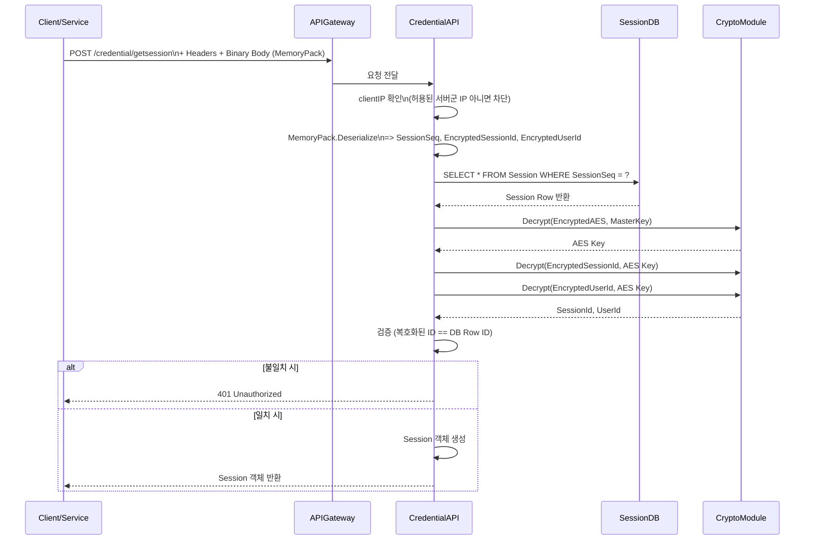

# Credential.GetSession API

## 개요

`Credential.GetSession` API는 내부 서비스 전용으로, 전달받은 세션 정보를 검증하고 유효한 경우 Session 객체를 반환하는 보안 API입니다. 외부 Client에서는 호출이 불가능하며, 오직 서버군의 IP에서만 접근이 허용됩니다.

---

## 요청 처리 흐름

1. **요청 헤더 검사**
   - `X-Forwarded-For` 또는 `RemoteIpAddress`에서 `clientIP` 확인
   - 내부 서버군에 포함되지 않은 IP인 경우 **403 Forbidden** 또는 **401 Unauthorized** 반환

2. **요청 본문 역직렬화**
   - Body는 `MemoryPack` 직렬화 형식으로 전달됨
   - 역직렬화를 통해 다음 값을 추출:
     - `SessionSeq`
     - `EncryptedSessionId`
     - `EncryptedUserId`

3. **Session Row 조회**
   - `SessionSeq`를 기준으로 Session Table에서 Row 조회

4. **AES 키 복호화**
   - Row에 저장된 `EncryptedAES`를 Master Key로 복호화하여 실제 AES 키 획득

5. **ID 복호화 및 검증**
   - AES 키로 `EncryptedSessionId`, `EncryptedUserId` 복호화
   - 복호화된 값과 Row의 `SessionId`, `UserId` 비교
   - 불일치 시 **401 Unauthorized** 반환

6. **Session 객체 생성 및 반환**
   - 검증 성공 시, 해당 Session Row를 기반으로 Session 객체 생성
   - 클라이언트 또는 호출 서비스에 Session 객체 반환

---

## Mermaid 시퀀스 다이어그램

