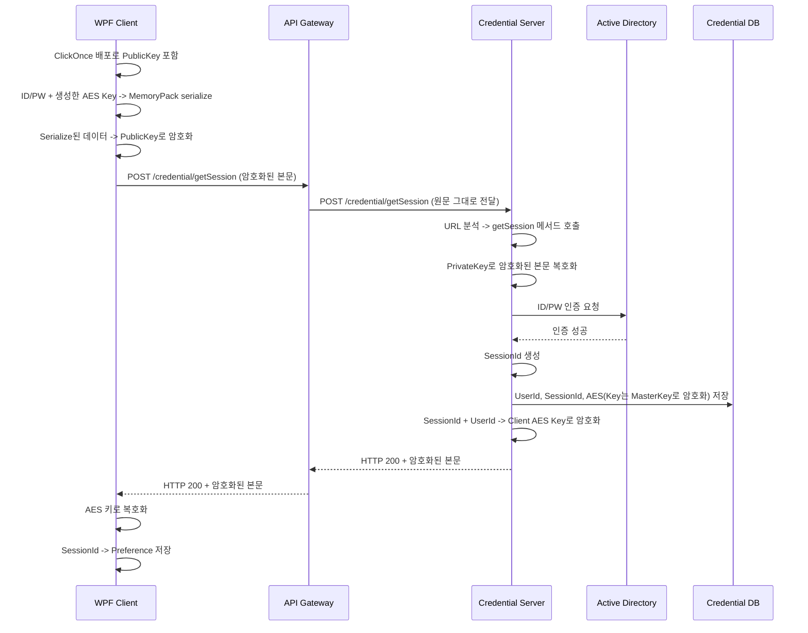

# GetSession

- 암호화 방식의 로그인을 처리하는 기능으로 아래와 같은 시퀀스를 가진다.

1. wpf앱은 clickonce로 배포한다. 이때 배포된 바이너리 속에 public key가 포함되어 있다. 이 public key로 ID/PW, 그리고 Client에서 생성한 AES 키를 포함해 Memorypack으로 serialize한뒤, 암호화 한다. 
2. apigateway에 credential.getSession api를 http로 호출하면서 암호화된 데이터를 전송한다. 
3. ApiGateway는 SessionId가 헤더에 없기 때문에 url을 보고, 원문 그대로 credential에게 전달한다.
4. Credential은 url의 getSession을 보고 getSession method를 호출한다. 
5. GetSession 에서는 private key로 본문을 복호화 하고, 그중, ID, PW를 Active Directory에 인증 처리를 한다. 만약 정상 인증이라면 SessionId를 생성하고, AES Key와 UserId, SessionId를 Credential DB의 Session table에 넣는다. 이때 AES는 서버 전체의 암호화를 위한 Master Key로 암호화 해 넣는다. 
6. Http Status는 200으로 반환하면서, SessionId, UserId를 전달한다. 이때 Client에서 전달 받은 대칭키로 암호화해 Apigateway로 보내고 이것을 Client에 전달한다. 
7. Client에서는 status 200일때, 본문을 가져와 생성했던 AES 키로 복호화 해, Session Id를 Client의 Preference에 저장한다.

