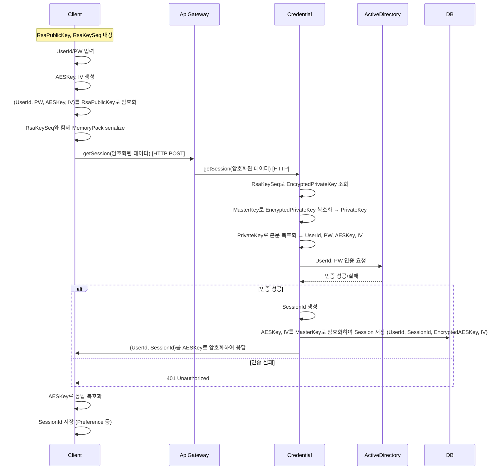

# GetSession

- 암호화 방식의 로그인을 처리하는 기능으로 아래와 같은 시퀀스를 가진다.

1. Client에는 public key와 RsaKeySeq가 포함되어 있다.
2. 로그인 화면에서 입력받은 UserId, Password를 public key로 암호화 한다. 그리고 AESKey, IV를 새로 생성해 이것도 public key로 암호화 한뒤, RsaKeySeq와 함께 Memorypack으로 serialize한다. 
3. client에서 ApiGateway로 credential.getSession api를 http로 호출하면서 암호화된 데이터를 전송한다. 
4. ApiGateway는 SessionId가 헤더에 없기 때문에 url을 보고, 원문 그대로 credential에게 전달한다.
5. Credential은 url의 getSession을 보고 getSession method를 호출한다. 
6. GetSession 에서는 RsaKeySeq를 보고 master key로 암호화된 encrypted private Key를 찾아 복호화 해 private key를 획득한다. private key로 본문을 복호화 하고, 그 중, ID, PW를 Active Directory에 인증 처리를 한다.
   만약 정상 인증이라면 SessionId를 생성하고, AES Key, IV와 UserId, SessionId를 Credential DB의 Session table에 넣는다. 이때 AES Key, IV는 Master Key로 암호화 해 넣는다. 만약 비정상이면 401을 반환한다.
7. Http Status는 200으로 반환하면서, SessionId, UserId를 전달한다. 이때 Client에서 전달 받은 대칭키로 암호화해 Apigateway로 보내고 이것을 Client에 전달한다. 
8. Client에서는 status 200일때, 본문을 가져와 생성했던 AES 키로 복호화 해, Session Id를 Client의 Preference에 저장한다.

